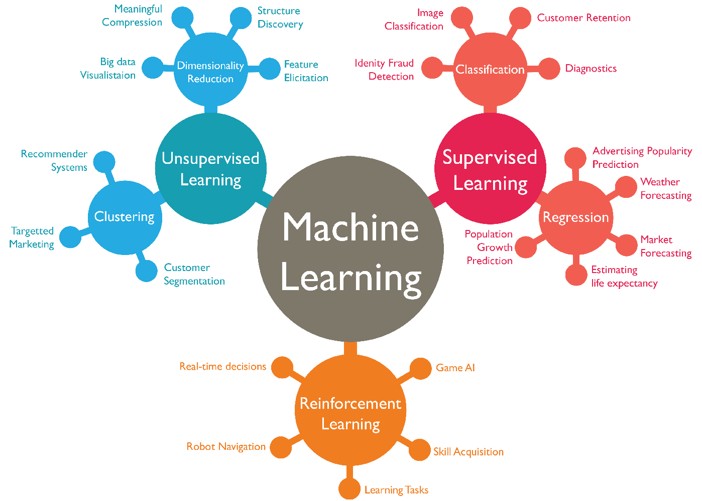
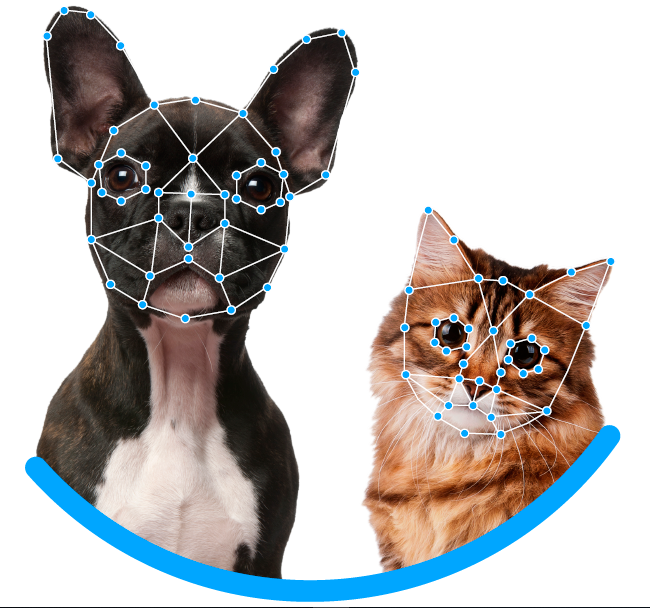
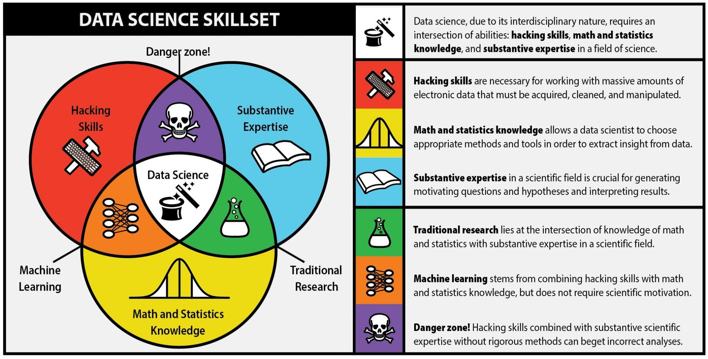
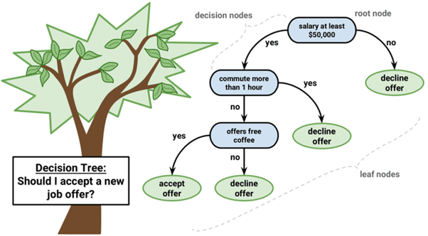
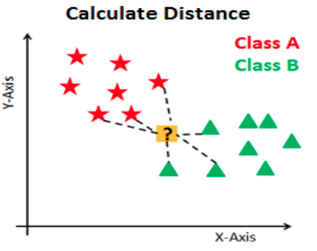

layout: true
background-size: contain

```{r logo, echo=F}
options(htmltools.dir.version = FALSE)

library(xaringanExtra)

# xaringanExtra::use_logo(
#   image_url = "img/congreso_3.png",
#   position = xaringanExtra::css_position(top = "1em", right = "1em")
# )

xaringanExtra::use_broadcast()

xaringanExtra::use_panelset()
xaringanExtra::style_panelset_tabs(
  active_foreground = "#061b94",
  foreground = "black",
  hover_foreground = "#000000",
  inactive_opacity = 0.5
)
```
---

background-image: url(img/congreso_3.png)
class: inverse, center, middle

.high-title[Ciencia de Datos y Machine Learning con R]

.size_text_18px[Act. Arturo Bringas]

---

background-image: url(img/congreso_2.png)
class: inverse, center, middle

.high-title[¿Qué está pasando en el mundo del análisis de los datos?]

---

background-image: url(img/01_complexity_confusion.png)
class: inverse, center, middle

---

background-image: url(img/congreso_1.png)
class: inverse, center

<br />
<br />
<br />

.panelset[

.panel[.panel-name[Statistics]

.pull-left[

.body[
Analiza e interpreta datos a través de una población muestral generando estadística descriptiva y estadística inferencial.

<br />

* **Estadística descriptiva:** Describe distribuciones, análisis exploratorio, correlaciones, outliers, etc.

<br />

* **Estadística inferencial:** Analiza estimaciones puntuales, intervalos de confianza o hipótesis para una población.

]

]

.pull-right[

```{r, echo = F, out.width = "545px", out.height="265px"}

knitr::include_graphics("img/02_muestra.jpg")
```

]

]

.panel[.panel-name[BI]
.pull-left[
```{r, echo = F, out.width = "545px", out.height="265px"}

knitr::include_graphics("img/03_bi.png")
```
]
.pull-right[

.body[
Aprovecha el software y servicios para transformar datos en **conocimientos prácticos que informan las decisiones estratégicas de una organización**. 

<br />

Acceden y analiza datos para **transformar hallazgos analíticos** en informes, resúmenes, tableros, gráficos, tablas, KPI’s y mapas para proporcionar inteligencia detallada sobre el estado del negocio.

Está enfocada en *analizar la historia pasada*.
]

]
]

.panel[.panel-name[Big Data]
.pull-left[
.body[
Grandes conjuntos de información que crecen a un ritmo cada vez mayor. Abarca los 3 "V":

* **V**olumen de información
* **V**elocidad a la que se crea y recopila
* **V**ariedad de datos que se cubren. 

Es común que se confunda los conceptos de **Big Data y Big Compute.** 

BD se refiere al procesamiento de conjuntos voluminosos y BC a herramientas y algoritmos que usan gran cantidad de recursos computacionales para resolver problemas complejos.
]
]

.pull-right[
```{r, echo = F, out.width = "545px", out.height="265px"}

knitr::include_graphics("img/04_bigdata.jpg")
```
]
]

.panel[.panel-name[ML]
.pull-left[
```{r, echo = F, out.width = "600px", out.height="270px"}


```
]
.pull-right[
.body[
Los algoritmos de Machine Learning se dividen en categorías:

**Supervisado:** Aprendizaje basado en etiquetas con respuestas correctas a partir de las cuales el algoritmo asocia patrones comunes en datsos.

**No supervisado:** Aprendizaje sin supervisión ni guía. Esto significa descubrir ¿qué es qué? por nosotros mismos.

**Por refuerzo:** Aprende a partir de experiencia propia. Esto es, que sea capaz de tomar la mejor decisión de acuerdo a un proceso de prueba y error en el que se recompensan las decisiones correctas. [Ejemplo](https://www.youtube.com/watch?v=qv6UVOQ0F44)
]
]
]

.panel[.panel-name[DL]
.pull-left[
.body[
Ocupa de los algoritmos inspirados en la estructura y función del cerebro llamados **redes neuronales artificiales**.

```{r, echo = F, out.width = "545px", out.height="100px"}

knitr::include_graphics("img/06_dl.png")
```

El modelo aprende a **clasificar a partir de imágenes, video, texto o sonido**. Los modelos de aprendizaje profundo pueden lograr una precisión de vanguardia. Los modelos se entrenan mediante el uso de un gran conjunto de datos y arquitecturas de redes neuronales que contienen muchas capas.
]
]
.pull-right[
```{r, echo = F, out.width = "545px", out.height="265px"}


```
]
]

.panel[.panel-name[Data Science]
```{r, echo = F, out.width = "600px", out.height="300px"}

```
]

]

---

background-image: url(img/congreso_1.png)
class: inverse, center

<br />
<br />
<br />

.panelset[

.panel[.panel-name[Datos y Etiquetas]
```{r, echo = F, out.width = "600px", out.height="300px"}
knitr::include_graphics("img/09_1_etiquetas.png")
```
]

.panel[.panel-name[Relevancia y Suficiencia]
```{r, echo = F, out.width = "600px", out.height="300px"}
knitr::include_graphics("img/09_2_relevancia_suficiencia.png")
```
]

.panel[.panel-name[Software]
```{r, echo = F, out.width = "600px", out.height="300px"}
knitr::include_graphics("img/09_3_lenguajes.png")
```
]

]

---

background-image: url(img/congreso_1.png)
class: inverse, center

<br />
<br />

.size_text_26px[Aplicaciones de Ciencia de Datos]

.pull-left[

.body[
**Aplicaciones centradas en clientes**

* Recomendaciones de productos
* Upselling & Cross-selling
* Reducir tasas de cancelación
* Análisis de sentimientos
* Personalización de productos o servicios
]

```{r, echo = F, out.width = "200px", out.height="150px"}

```
]

.pull-right[

```{r, echo = F, out.width = "200px", out.height="180px"}

```

.body[
**Optimización de problemas**

* Optimización de precios
* Ubicación de nuevas sucursales
* Maximización de ganancias mediante producción de materias primas
* Construcción de portafolios de inversión
]
]

---

background-image: url(img/congreso_1.png)
class: inverse, center

<br />
<br />

.size_text_26px[Aplicaciones de Ciencia de Datos]

.pull-left[

```{r, echo = F, out.width = "200px", out.height="150px"}
knitr::include_graphics("img/12_forecasting.jpeg")
```


.body[
**Predicción de demanda**

* Número futuro de clientes
* Número esperado de viajes
* Número por virus (demanda médica/ medicamentos/ etc)
* Predicción de uso de recursos 
]

]

.pull-right[

.body[
**Análisis de detección de fraude**

* Detección de robo de identidad
* Detección de transacciones ilícitas
* Detección de servicios fraudulentos
* Detección de zonas geográficas con actividades ilícitas

```{r, echo = F, out.width = "320px", out.height="160px"}

```

]
]

---

background-image: url(img/congreso_1.png)
class: inverse, center

<br />
<br />

.size_text_26px[ML - Aprendizaje Supervisado]

.pull-left[

.body[
Se realiza la **detección de patrones** para aprender las relaciones existentes entre las variables explicativas y la respuesta a predecir. Posteriormente, dependiendo del tipo de respuesta se realiza la clasificación o regresión predictiva
]

```{r, echo = F, out.width = "300px", out.height="230px"}
knitr::include_graphics("img/14_bot_supervisado.png")
```
]
.pull-right[
```{r, echo = F, out.width = "370px", out.height="225px"}
knitr::include_graphics("img/15_regresion_clasificacion.png")
```

.body[
Existen algoritmos que operan con cada uno de los tipos de respuesta y algunos de ellos logran adaptarse al tipo de respuesta indicado.
]
]

---

background-image: url(img/congreso_1.png)
class: inverse, center

<br />
<br />

.size_text_26px[ML - Aprendizaje NO Supervisado]

.pull-left[
.body[
A partir de **similitudes entre los elementos** en observación, se realizan agrupaciones que pueden ayudar a:

* Segmentar clientes
* Reducir dimensión de grandes datos
* Realizar sistemas de recomendación
* Etc.
]
```{r, echo = F, out.width = "300px", out.height="215px"}
knitr::include_graphics("img/17_bot_no_supervisado.png")
```
]

.pull-right[
```{r, echo = F, out.width = "300px", out.height="200px"}
knitr::include_graphics("img/16_recommendation.png")
```
.body[
A menudo se combinan los algoritmos de aprendizaje de máquina supervisado y no supervisado para crear sistemas predictivos que ayuden a **mejorar la precisión**
]

]
---

background-image: url(img/congreso_2.png)
class: inverse, center, middle

.high-title[Manos a la obra]
<br />
<br />
.high-title[¿Cómo iniciamos?]

---

background-image: url(img/congreso_1.png)
class: inverse, center

<br />
<br />

.size_text_26px[División de datos]

.pull-left[

.body[
Para realizar el entrenamiento y prueba del mejor modelo posible, los datos se segmentan en 3 conjuntos.

* **Training:** Conjunto a través del cual se **construye el modelo**. Se calculan parámetros que usará el modelo para hacer predicciones.

* **Validation:** Se usa para **validar las decisiones** de configuración del modelo. Se seleccionan hiper-parámetros que producen mejor resultado predictivo sobre este conjunto de datos.

* **Testing:** Prueba predictiva final que permite **conocer el futuro poder predictivo** similar al que se obtendrá cuando el modelo se encuentre en producción.
]
]

.pull-right[
```{r, echo = F, out.width = "420px", out.height="290px"}
knitr::include_graphics("img/18_conjunto_validacion.png")
```
]

---

background-image: url(img/congreso_1.png)
class: inverse, center

<br />
<br />

.size_text_26px[División de datos - KFCV]

.pull-left[
.body[
Una estrategia que permite seleccionar ágilmente los mejores hiper-parámetros de configuración es **probar con distintas opciones en distintas divisiones de datos** y elegir el que permita obtener mejores resultados. 
]
```{r, echo = F, out.width = "350px", out.height="230px"}

```

]

.pull-right[
```{r, echo = F, out.width = "370px", out.height="230px"}
knitr::include_graphics("img/18_1_cross_validation.png")
```
.body[
A partir del cálculo del poder predictivo de cada uno de los folds creados, se calcula el error promedio de cada configuración y finalmente se elige el modelo que tenga **mejor poder predictivo promedio**.
]
]

---

background-image: url(img/congreso_1.png)
class: inverse, center

<br />
<br />

.size_text_26px[Ingeniaría de variables]

---

background-image: url(img/congreso_1.png)
class: inverse, center

<br />
<br />

.size_text_26px[Respuesta Numérica - Regresión Lineal]

.body[
**Regresión Lineal Simple:** Realiza el ajuste de una recta permita conocer la relación existente entre una única variable explicativa **X** para predecir una respuesta numérica **Y**. La predicción se realiza a través de:

$$\hat{Y} = \hat{\beta}_0 + \hat{\beta}_1X_1 + \epsilon \approx b + mx$$
]


```{r, warning=FALSE, message=FALSE, echo=FALSE, out.width = "100%", out.height="40%"}
library(plotly)

fit <- lm(Sepal.Length ~ Petal.Length, data = iris)

rls <- iris %>% 
  plot_ly(x = ~Petal.Length) %>% 
  add_markers(y = ~Sepal.Length) %>% 
  add_lines(x = ~Petal.Length, y = fitted(fit))

rls
```

---

background-image: url(img/congreso_1.png)
class: inverse, center

<br />
<br />

.size_text_26px[Respuesta Numérica - Regresión Lineal]

.body[
**Regresión Lineal Múltiple:** Realiza el ajuste de un hiper-plano que permita conocer la relación existente entre múltiples variables explicativas $\{X_1, X_2, ... , X_p \}$ para predecir una respuesta numérica **Y**. La predicción se realiza a través de:
$$\hat{Y} = \hat{\beta}_0 + \hat{\beta}_1X_1 + \hat{\beta}_2X_2 + ... + \hat{\beta}_pX_p + \epsilon $$
]

```{r, warning=FALSE, message=FALSE, echo=FALSE, out.width = "100%", out.height="40%"}
library(reshape2)

my_df <- iris
petal_lm <- lm(Petal.Length ~ Sepal.Length + Sepal.Width, data = my_df)
graph_reso <- 0.05

#Setup Axis
axis_x <- seq(min(my_df$Sepal.Length), max(my_df$Sepal.Length), by = graph_reso)
axis_y <- seq(min(my_df$Sepal.Width), max(my_df$Sepal.Width), by = graph_reso)

#Sample points
petal_lm_surface <- expand.grid(Sepal.Length = axis_x,Sepal.Width = axis_y, KEEP.OUT.ATTRS = F)
petal_lm_surface$Petal.Length <- predict.lm(petal_lm, newdata = petal_lm_surface)
petal_lm_surface <- acast(petal_lm_surface, Sepal.Width ~ Sepal.Length, value.var = "Petal.Length") 

hcolors=c("red","blue","green")[my_df$Species]
iris_plot <- plot_ly(
  my_df, 
  x = ~Sepal.Length, 
  y = ~Sepal.Width, 
  z = ~Petal.Length,
  text = ~Species, # EDIT: ~ added
  type = "scatter3d", 
  mode = "markers",
  size = 0.05,
  marker = list(color = hcolors)
  )

iris_plot <- add_trace(
  p = iris_plot,
  z = petal_lm_surface,
  x = axis_x,
  y = axis_y,
  type = "surface"
  )

iris_plot
```

---

background-image: url(img/congreso_1.png)
class: inverse, center

<br />
<br />

.size_text_26px[Respuesta Numérica - Regresión KNN]

.body[
**K Vecinos más Cercanos:** Realiza comparaciones de cada elemento por predecir contra todas las observaciones conocidas para posteriormente estimar la predicción de un nuevo elemento **a través del promedio de los _K_ vecinos más parecidos.** La cantidad de vecinos cercanos determinará la flexibilidad del modelo. 

* A mayor número de vecinos, el modelo será más rigido y tendrá más sesgo y menos varianza.  
* A menor número de vecinos, el modelo será más flexible, logrando mayor varianza y menos sesgo.
]

```{r, echo = F, out.width = "210px", out.height="180px"}
knitr::include_graphics("img/18_1_regression_knn1.png")
knitr::include_graphics("img/18_2_regression_knn2.png")
knitr::include_graphics("img/18_3_regression_knn3.png")
```

.body[
No existe una *K* mágica, la **elección óptima de *"K"* se determina mediante pruebas iterativas de ensayo y error**, de forma que se elige la que ajuste mejor a los datos.
]

---

background-image: url(img/congreso_1.png)
class: inverse, center

<br />
<br />

.size_text_26px[Respuesta Numérica - Regresión KNN]

.body[
**K Vecinos más Cercanos:** Realiza comparaciones de cada elemento por predecir contra todas las observaciones conocidas para posteriormente estimar la predicción de un nuevo elemento **a través del promedio de los _K_ vecinos más parecidos.** La cantidad de vecinos cercanos determinará la flexibilidad del modelo. 

* A mayor número de vecinos, el modelo será más rigido y tendrá más sesgo y menos varianza.  
* A menor número de vecinos, el modelo será más flexible, logrando mayor varianza y menos sesgo.
]

```{r, echo = F, out.width = "210px", out.height="180px"}


```

.body[
No existe una *K* mágica, la **elección óptima de *"K"* se determina mediante pruebas iterativas de ensayo y error**, de forma que se elige la que ajuste mejor a los datos.
]

---

background-image: url(img/congreso_1.png)
class: inverse, center

<br />
<br />

.size_text_26px[Tree Decision]

.pull-left[
.body[
**Árbol de decisión:** Es un clasificador estructurado de manera jerárquica (árbol), en donde:

* Los nodos internos representan las características de un conjunto de datos
* Las ramas representan las reglas de decisión 
* Cada nodo hoja representa el resultado. 
]

```{r, echo = F, out.width = "260px", out.height="190px"}
knitr::include_graphics("img/19_1_arboles.png")
```

]

.pull-right[
```{r, echo = F, out.width = "320px", out.height="220px"}

```

.body[
La idea básica de los árboles es **buscar puntos de corte** en las variables de entrada para hacer predicciones, ir dividiendo la muestra y encontrar cortes para **refinar las predicciones.**
]
]

---

background-image: url(img/congreso_1.png)
class: inverse, center

<br />
<br />

.size_text_26px[Respuesta Numérica - Tree Decision]

.body[
En el caso de un **árbol de regresión**, los cortes se realizan de manera que disminuya la varianza al interior de cada uno de los grupos formados a partir de la rama de decisión.
]

```{r, echo = F, out.width = "300px", out.height="200px"}
knitr::include_graphics("img/20_1_arbol_reg_diagram.png")
#knitr::include_graphics("img/20_2_arbol_reg_graph.png")
knitr::include_graphics("img/20_3_arbol_reg_ejemplo.png")
```

.body[
Posteriormente, para realizar predicciones de nuevas observaciones se calcula **el promedio de la variable de respuesta** de los elementos observados contenidos en el grupo para lograr estimaciones de nuevas observaciones que sean clasificados en el nodo hoja creado
]

---

background-image: url(img/congreso_1.png)
class: inverse, center

<br />
<br />

.size_text_26px[Respuesta Numérica - Random Forest]

.body[
El proceso de toma de decisión jerárquica puede mejorarse al considerar el **promedio del resultado** de miles de árboles creados a partir de **muestras bootstrap**, las cuales crean variación en los datos para detectar los patrones consistentes y desechar aquellos producidos por ruido o datos atípicos.
]
```{r, echo = F, out.width = "280px", out.height="235px"}
knitr::include_graphics("img/21_2_bagging.png")
```
```{r, echo = F, out.width = "280px", out.height="220px"}

```

.body[
La **agregación** del resultado de múltiples modelos puede en muchas ocasiones **mejorar el desempeño final**, sin embargo, esta mejora **se paga con recursos computacionales**
]

---

background-image: url(img/congreso_1.png)
class: inverse, center

<br />
<br />

.size_text_26px[Respuesta Categórica - Regresión Logística]

.body[
**Modelo de clasificación**

A partir de una o más variables explicativas, se estima la **probabilidad de pertenecer a la categoría _positiva_ de una variable de respuesta categórica**. Posteriormente, se determina el umbral de probabilidad a partir del cual se clasifica a una observación como positiva o negativa.

$$P[Y = 1 | X] = \frac{e^{\hat{\beta}_0 + \hat{\beta}_1X_1 + ... + \hat{\beta}_pX_p}}{1 + e^{\hat{\beta}_0 + \hat{\beta}_1X_1 + ... + \hat{\beta}_pX_p}}$$
]

```{r, echo=FALSE, warning=FALSE, message=FALSE, out.width = "90%", out.height="31%"}
library(ggplot2)
library(tidyr)
library(MASS)
library(plotly)

set.seed(24601) 

covmat <- matrix(c(1.0,   0.2,   0.6, 
                   0.2,   1.0,  -0.5, 
                   0.6,  -0.5,   1.0), nrow=3) # the true cov matrix for my data
data <- mvrnorm(300, mu=c(0,0,0), Sigma=covmat) # generate random data that match that cov matrix
colnames(data) <- c("X1", "X2", "DV")
data <- as.data.frame(data)
data$group <- gl(n=3, k=ceiling(nrow(data)/3), labels=c("a", "b", "c", "d"))
data$DV <- with(data, ifelse(group=="c" & X1 > 0, DV+rnorm(n=1, mean=1), 
                             ifelse(group=="b" & X1 > 0, DV+rnorm(n=1, mean=2) , DV)))
data$DV <- ifelse(data$DV > 0, 1, 0)

b0 <- -0.5872841 # intercept
X1 <- 2.6508212
X2 <- -2.2599250
groupb <- 2.2110951
groupc <- 0.6649971
X1.X2 <- 0.1201166
X1.groupb <- 2.7323113
X1.groupc <- -0.6816327
X2.groupb <- 0.8476695
X2.groupc <- 0.4682893

X1_range <- seq(from=min(data$X1), to=max(data$X1), by=.01)
X2_val <- mean(data$X2)

a_logits <- b0 + 
  X1*X1_range + 
  X2*X2_val + 
  groupb*0 + 
  groupc*0 + 
  X1.X2*X1_range*X2_val + 
  X1.groupb*X1_range*0 + 
  X1.groupc*X1_range*0 + 
  X2.groupb*X2_val*0 + 
  X2.groupc*X2_val*0 

b_logits <- b0 + 
  X1*X1_range + 
  X2*X2_val + 
  groupb*1 + 
  groupc*0 + 
  X1.X2*X1_range*X2_val + 
  X1.groupb*X1_range*1 + 
  X1.groupc*X1_range*0 + 
  X2.groupb*X2_val*1 + 
  X2.groupc*X2_val*0

c_logits <- b0 + 
  X1*X1_range + 
  X2*X2_val + 
  groupb*0 + 
  groupc*1 + 
  X1.X2*X1_range*X2_val + 
  X1.groupb*X1_range*0 + 
  X1.groupc*X1_range*1 + 
  X2.groupb*X2_val*0 + 
  X2.groupc*X2_val*1

a_probs <- exp(a_logits)/(1 + exp(a_logits))
b_probs <- exp(b_logits)/(1 + exp(b_logits))
c_probs <- exp(c_logits)/(1 + exp(c_logits))

plot.data <- data.frame(a=a_probs, b=b_probs, c=c_probs, X1=X1_range)
plot.data <- gather(plot.data, key=group, value=prob, a:c) %>% 
  dplyr::sample_n(size = 600)

plot1 <- ggplot(plot.data, aes(x=X1, y=prob, color=group)) + 
 geom_jitter(size = 0.5, width = 0.05, height = 0.05) + 
 geom_line(lwd=0.5) + 
 labs(x="X1", y="P(outcome)") +
  theme(legend.title=element_blank())

plotly::ggplotly(plot1)

```

---

background-image: url(img/congreso_1.png)
class: inverse, center

<br />
<br />

.size_text_26px[Respuesta Categórica - Clasificación KNN]

.body[
**K Vecinos más Cercanos:** Realiza comparaciones de cada elemento por predecir contra todas las observaciones conocidas para posteriormente estimar la predicción de un nuevo elemento **a través de la moda de los _K_ vecinos más parecidos.** La cantidad de vecinos cercanos determinará la flexibilidad del modelo. 

* A mayor número de vecinos, el modelo será más rigido y tendrá más sesgo y menos varianza.  
* A menor número de vecinos, el modelo será más flexible, logrando mayor varianza y menos sesgo.
]

```{r, echo = F, out.width = "210px", out.height="180px"}
knitr::include_graphics("img/20_1_classification_knn.png")

knitr::include_graphics("img/20_3_classification_knn.png")
```

.body[
No existe una *K* mágica, la **elección óptima de *"K"* se determina mediante pruebas iterativas de ensayo y error**, de forma que se elige la que ajuste mejor a los datos.
]

---

background-image: url(img/congreso_1.png)
class: inverse, center

<br />
<br />

.size_text_26px[Respuesta Categórica - Clasificación KNN]

.body[
**K Vecinos más Cercanos:** Realiza comparaciones de cada elemento por predecir contra todas las observaciones conocidas para posteriormente estimar la predicción de un nuevo elemento **a través de la moda de los _K_ vecinos más parecidos.** La cantidad de vecinos cercanos determinará la flexibilidad del modelo. 

* A mayor número de vecinos, el modelo será más rigido y tendrá más sesgo y menos varianza.  
* A menor número de vecinos, el modelo será más flexible, logrando mayor varianza y menos sesgo.
]

```{r, echo = F, out.width = "250px", out.height="180px"}


```

.body[
No existe una *K* mágica, la **elección óptima de *"K"* se determina mediante pruebas iterativas de ensayo y error**, de forma que se elige la que ajuste mejor a los datos.
]

---

background-image: url(img/congreso_1.png)
class: inverse, center

<br />
<br />

.size_text_26px[Respuesta Categórica - Tree Decision]

.body[
En el caso de un **árbol de clasificación**, los cortes se realizan de manera que disminuya la impureza de categorías al interior de cada uno de los grupos formados a partir de la rama de decisión.
]

```{r, echo = F, out.width = "300px", out.height="200px"}
knitr::include_graphics("img/22_1_arbol_class_diagram.png")
knitr::include_graphics("img/22_2_arbol_class_graph.png")
```

.body[
Posteriormente, para realizar predicciones de nuevas observaciones se calcula **la moda de la variable de respuesta** de los elementos observados contenidos en el grupo para lograr estimaciones de nuevas observaciones que sean clasificados en el nodo hoja creado
]

---

background-image: url(img/congreso_1.png)
class: inverse, center

<br />
<br />

.size_text_26px[Respuesta Categórica - Random Forest]

.body[
El proceso de toma de decisión jerárquica puede mejorarse al considerar el **promedio del resultado** por *votación de la mayoría* de miles de árboles creados a partir de **muestras bootstrap**, las cuales crean variación en los datos para detectar los patrones consistentes y desechar aquellos producidos por ruido o datos atípicos.
]
```{r, echo = F, out.width = "390px", out.height="230px"}
knitr::include_graphics("img/23_1_randomforest_ejemplo.jpg")
```
```{r, echo = F, out.width = "340px", out.height="230px"}
knitr::include_graphics("img/23_2_randomforest.png")
```

.body[
La **agregación** del resultado de múltiples modelos puede en muchas ocasiones **mejorar el desempeño final**, sin embargo, esta mejora **se paga con recursos computacionales.**
]
